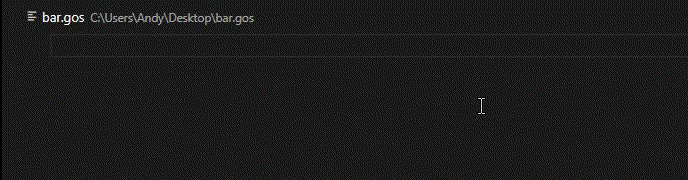

# GoS Language

La extensi&oacute;n del lenguaje GoS, un DSL para la aplicaci&oacute;n *Game of Servers*. Este es un proyecto escolar que involucra a las asignaturas de Inteligencia Artifical, Simulaci&oacute;n y Compilaci&oacute;n, de la carrera de Ciencias de la Computaci&oacute;n.

S&iacute;ganos [en Github:link:](https://github.com/CSProjectsAvatar/SimCopIA).

## Caracter&iacute;sticas
Esta extensi&oacute;n provee soporte para la sintaxis de GoS.

<!-- @todo haz q el gif ilustre mejor el propo'sito del DSL -->