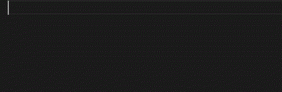

# GoS

La extensi&oacute;n del lenguaje GoS, un DSL para la aplicaci&oacute;n *Game of Servers*. Este es un proyecto escolar que involucra a las asignaturas de Inteligencia Artifical, Simulaci&oacute;n y Compilaci&oacute;n, de la carrera de Ciencias de la Computaci&oacute;n.

S&iacute;ganos [en Github](https://github.com/CSProjectsAvatar/SimCopIA).

## Caracter&iacute;sticas
Esta extensi&oacute;n provee soporte para la sintaxis de GoS.

En este lenguaje se puede declarar funciones:

*Statements* en varias l&iacute;neas:

Crear servidores de tipo *worker* simple y distribuidores de carga:

Conectarlos:

Para m&aacute;s informaci&oacute;n puede visitar [nuestro reporte de desarrollo](https://github.com/CSProjectsAvatar/SimCopIA/blob/dev/reporte.pdf).