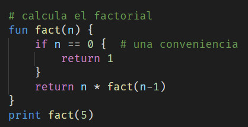
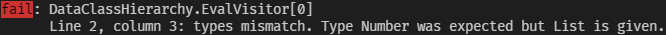
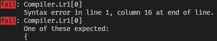

<h1> Manual de Usuario </h1>

- [Descarga de la Aplicaci&oacute;n](#descarga-de-la-aplicación)
- [Extensi&oacute;n de Visual Studio Code](#extensión-de-visual-studio-code)
- [Interfaz](#interfaz)
- [Funcionalidades y Caracter&iacute;sticas del Lenguaje](#funcionalidades-y-características-del-lenguaje)
  - [Identificadores](#identificadores)
  - [Variables](#variables)
  - [*Statements*](#statements)
  - [Contextos](#contextos)
  - [Tipos y Operaciones](#tipos-y-operaciones)
    - [N&uacute;meros](#números)
    - [Expresiones Booleanas](#expresiones-booleanas)
    - [Listas](#listas)
    - [Recursos](#recursos)
    - [Capas](#capas)
    - [Servidores](#servidores)
    - [Pedido](#pedido)
    - [Respuesta](#respuesta)
    - [Ambiente](#ambiente)
    - [Estado](#estado)
  - [Condicionales](#condicionales)
  - [Ciclos](#ciclos)
  - [Funciones](#funciones)
  - [Comportamientos](#comportamientos)
    - [`ping`](#ping)
    - [`ask`](#ask)
    - [`order`](#order)
    - [`alarm_me`](#alarm_me)
    - [`respond`](#respond)
    - [`accept`](#accept)
    - [`process`](#process)
    - [`respond_or_save`](#respond_or_save)
    - [`save`](#save)
    - [Contratado](#contratado)

## Descarga de la Aplicaci&oacute;n
En nuestro [repositorio de Github](https://github.com/CSProjectsAvatar/SimCopIA) se encuentran las entregas (*releases*) de la aplicaci&oacute;n. En las &uacute;ltimas de ellas (de [Entrega Final v0](https://github.com/CSProjectsAvatar/SimCopIA/releases/tag/v3.0.0) en adelante) aparecen dos comprimidos que contienen la aplicaci&oacute;n: uno para Linux-x64 y otro para Windows-x64.

En lo que sigue de documento, se asume que el directorio base para cualquier ruta que se mencione es la carpeta `linux-x64/` o `win-x64/`, en dependencia del comprimido que se haya descargado. Cuando se haga alusi&oacute;n a una terminal, esta debe estar ubicada en el directorio mencionado.

## Extensi&oacute;n de Visual Studio Code
El equipo desarroll&oacute; una extensi&oacute;n de Visual Studio Code para que GoS tenga *syntax highlight* en ese editor de texto. Se puede acceder a ella mediante [este enlace](https://marketplace.visualstudio.com/items?itemName=TheGoSTeam.gos).



## Interfaz
El proyecto cuenta con una simple interfaz de l&iacute;nea comandos que el ejecutable `gos` provee.

El comando `init` crea un archivo llamado `lr1-dfa.json` que contiene el aut&oacute;mata del parser LR(1) empleado. Este comando se debe llamar cada vez que se modifica la gram&aacute;tica de GoS.

El comando `run` interpreta un *script* de GoS y, de ser posible, ejecuta la simulaci&oacute;n que se configura. A modo de ejemplo, podemos crear un archivo `fact.gos` en el directorio `Sources/` con el siguiente c&oacute;digo:

    # calcula el factorial
    fun fact(n) {
        if n == 0 {  # una conveniencia
            return 1
        }
        return n * fact(n-1)
    }
    print fact(5)

y ejecutarlo mediante
```console
$ gos run Sources/fact.gos
120
warn: DataClassHierarchy.EvalVisitor[0]
      No servers are accessible from the global context. 
      Simulation won't run.
```

## Funcionalidades y Caracter&iacute;sticas del Lenguaje

### Identificadores
En GoS los nombres de variables, funciones, comportamientos, propiedades, etc, deben seguir las siguientes reglas:

1. poseer solamente n&uacute;meros, letras del alfabeto inglés (may&uacute;sculas y min&uacute;sculas) y el caracter `_`.
2. no comenzar con n&uacute;mero.
3. poseer al menos una letra.

Son identificadores v&aacute;lidos: *cAsA*, *___a*, *alfa123*, *nombre_de_variable*.

No son v&aacute;lidos:
- *_1*, porque no posee letra (regla 3).
- *nombre de variable*, porque posee espacios (regla 1).
- *1ra_var*, porque empieza con n&uacute;mero (regla 2).
- *pureza_20%*, porque posee el caracter *%* (regla 1).
- *año*, porque contiene *ñ* (regla 1).

Promovemos el uso [*snake case*](https://en.wikipedia.org/wiki/Snake_case) para nombrar identificadores. 

En GoS no hay constantes, por ende, recomendamos nombrar con todas las letras en may&uacute;sculas  a las variables que no deben cambiar su valor. Por ejemplo:

    let PI = 3.14
    let MESES_DEL_ANYO = 12

### Variables
Las variables se definen mediante la palabra reservada `let`.

    let a = 3
    let b = 4
    let c = 5

No se pueden definir dos variables de igual nombre en un mismo contexto. El identificador de la variable tampoco puede coincidir con el nombre de una funci&oacute;n o comportamiento en un mismo contexto (ver [Contextos](#contextos)).

Al definir una variable, se eval&uacute;a la expresión a la derecha del `=` y se determina que el tipo de la variable es el tipo del valor obtenido. Luego de que una variable es definida, su valor puede ser alterado, siempre y cuando el tipo del nuevo valor coincida con el tipo de la variable (ver [Tipos y Operaciones](#tipos-y-operaciones)).

Lo siguiente es v&aacute;lido:

    let a = 3
    a = 4
    a = 3.5

Mientras que esto, no:

    let a = 3
    a = [2, 3]

Salida:



Existen variables predefinidas en el lenguaje, a saber:

| Identificador | Valor |
|----|-----|
| ASK | 0 |
| ORDER | 1 |
| PING | 2 |

que representan el tipo de un pedido.

### *Statements*
En GoS hay dos tipos de *statement:* **_inline_** y **_de bloque_**.

Un *statement* *inline* usualmente abarca una sola l&iacute;nea, pero mediante `\` se puede lograr que un *statement* de este tipo abarque m&aacute;s de una l&iacute;nea.

En una sola l&iacute;nea:

    let a = 3 + 4*3

En varias l&iacute;neas:

    let a = 3 \
          + 4 \
          * 3 

Por otro lado, los *statements* de bloque pueden contener a otros *statements* dentro de un espacio de c&oacute;digo delimitado por llaves (`{}`). Ejemplos de estos tipos de *statements* son:
- declaraci&oacute;n de funciones:
  
  ```
  fun suma(a, b) {
      let c = a + b
      print c
  }
  ```
- bloques if, else_if y else

    ```
    if 3 == 5 {
        print true
        print 1

    } else_if 2 == 3 {
        print false

    } else {
        print 3+2 == 5
        print 0
    }
    ```
- ciclos
  ```
  forever {
      print true
      print false
  }
  ```

La llave inicial que delimita el c&oacute;digo interior debe colocarse en la l&iacute;nea inicial de declaraci&oacute;n del bloque. Por ende, un c&oacute;digo como el siguiente:

    fun suma(a, b) 
    {
        let c = a + b
        print c
    }

Produce la siguiente salida:



### Contextos

El int&eacute;rprete de GoS crea un contexto global por defecto.

En todo momento, cuando el int&eacute;rprete procede a ejecutar los *statements* que se encuentran en el interior de un *statement* de bloque, crea un nuevo contexto "hijo" del contexto actual y el nuevo contexto pasa a ser el actual.

Una variable se define en el contexto que se encuentra como actual cuando se ejecuta el *statement* `let`, sin tener en cuenta ning&uacute;n contexto ancestro. Para acceder al valor de una variable se consulta el contexto actual y todos los contextos ancestros, del m&aacute;s al menos cercano, hasta encontrar la variable.

Este enfoque trae consigo lo siguiente:
- es posible definir una variable con el mismo nombre en contextos distintos,
- el valor de una variable definida en un contexto oculta los valores de variables hom&oacute;nimas definidas en contextos superiores:
  ```
  let a = 3

  if 3 < 5 {
      let a = 5
      print a
  }
  ```

  Salida:
  ```
  5
  ```
- no se puede acceder al valor de una variable definida en un contexto descendiente:
  ```
  print a

  if 3 < 5 {
      let a = 5
  }
  print a
  ```
  En el ejemplo anterior, al ejecutar cualquiera de los *statements* `print`, el int&eacute;rprete notifica que la variable `a` no existe.

### Tipos y Operaciones
En GoS no se pueden definir nuevos tipos, por lo que s&oacute;lo es posible utilizar los 15 tipos que el lenguaje provee. Algunos de ellos no poseen literales o no se pueden instanciar.

| Tipo | Descripci&oacute;n | Literal (instancia) |
|------| -------|----------|
| `Number` | N&uacute;mero positivo.| `3`, `2.35`, `100`, etc. |
| `Bool` | Valor de verdad. | `true` o `false`. |
| `String` | Cadena de caracteres. | |
| `List` | Lista de elementos de un mismo tipo. | `[]`, `[1, 2, 3]`, `[true, false]`, etc.
| `Null` | Tipo de retorno de funciones que no retornan valor. | |
| `Server` | Servidor. | `new server` |
| `ServerStatus` | Estado de servidor. | |
| `Function` | Funci&oacute;n. | Declaraci&oacute;n de funci&oacute;n. |
| `Behavior` | Comportamiento de servidor. | Declaraci&oacute;n de comportamiento. |
| `Layer` | Capa de comportamientos. | `new layer` |
| `Resource` | Recurso a satisfacer. | `new resource` |
| `Request` | Pedido a un servidor. | |
| `Response` | Respuesta a un pedido. | |
| `Alarm` | Se&ntilde;al de aviso a un servidor. | |
| `Environment` | Ambiente en el cual se desarrolla la simulaci&oacute;n. | |

Algunos de estos tipos poseen propiedades y m&eacute;todos, a los cuales se pueden acceder mediante el operador `.`.

Al modificar una propiedad o llamar a un m&eacute;todo de un tipo, se aplica una sem&aacute;ntica de referencia:

    # con listas
    let l1 = [1, 2, 3]
    let l2 = l1

    l1.add(4)

    print l2

    # con recursos
    let r1 = new resource
    let r2 = r1

    r1.time = 5

    print r2.time

Salida:

    [1, 2, 3, 4]
    5

N&oacute;tese c&oacute;mo los estados de `l2` y `r2` cambian al alterar los estados de `l1` y `r1`, respectivamente. `l1` y `l2` son el mismo objeto, detr&aacute;s de nombres diferentes; al igual que `r1` y `r2`.

Para ciertos casos, se puede saber si una expresi&oacute;n es de un tipo, mediante las palabras claves `is` y `not`. El resultado de este tipo de operaciones es un `Bool`.

    let es_req = r is request
    let no_resp = r is not response

Despu&eacute;s de un `is` o un `is not` solo puede ir alguna de las siguientes palabras: `server`, `request`, `response`, `alarm`, `resource` o `layer`.

Opcionalmente, se puede colocar al final de la expresi&oacute;n un identificador. De ese momento en adelante, en el contexto se puede acceder mediante ese identificador al objeto al que se le consulta el tipo. Esta es una caracter&iacute;stica similar a la de C#.

    if r is request req {
        # utilizo req
    }
    # utilizo req

#### N&uacute;meros
Los n&uacute;meros se pueden comparar mediante los operadores `>` y `<`. Tambi&eacute;n, al igual que el resto de los tipos, se puede saber si dos n&uacute;meros son iguales mediante el operador `==`. Los n&uacute;meros se pueden sumar (`+`), restar (`-`), dividir (`/`) y multiplicar (`*`) entre ellos, as&iacute; como saber el resto de la divisi&oacute;n (`%`).

#### Expresiones Booleanas
Expresiones complejas de tipo `Bool` se pueden formar empleando los operadores l&oacute;gicos de corto-circuito `or` y `and`. 

    let cond = x%2==0 and x%3==0 or x%5==0 

#### Listas

De una lista se puede obtener cu&aacute;ntos elementos posee mediante la propiedad `length`.

    let l = [1, 17, 3]
    print l.length

Salida:

    3

Acceder a un elemento de una lista es posible mediante el uso de corchetes (`[]`). Entre estos se debe colocar la posici&oacute;n a la que se desea acceder (un n&uacute;mero mayor o igual que `1` y menor o igual que `length`).

    let l = [1, 17, 3]
    print l[1]
    print l[2]
    print l[3]

Salida:

    1
    17
    3


Con el m&eacute;todo `add()` se puede a&ntilde;adir un elemento y con `del_at()` se elimina el objeto que se encuentra en la posici&oacute;n dada.

    let l = [23, 1, 15]

    l.add(12)
    print l

    l.del_at(3)
    print l

Salida:

    [23, 1, 15, 12]
    [23, 1, 12]

#### Recursos
Una vez se crea un recurso, es posible asignarle un tiempo de demora y declarar que depende de otros recursos.

    let r1 = new resource
    let r2 = new resource
    let r3 = new resource

    r3.requirements = [r1, r2]
    r3.time = 35

Cuando un recurso se crea, se le asigna autom&aacute;ticamente un nombre, el cual puede ser consultado mediante la propiedad `name`.

    let r = new resource
    print r.name

Salida (puede variar):

    resrc_1

Tambi&eacute;n se puede conocer del recurso el tiempo asignado (`time`), sus requisitos (`requirements`) y si es requerido por alg&uacute;n otro (`required`).

#### Capas
Para asociar comportamientos a una capa, se asigna una lista a la propiedad `behaviors`. La funci&oacute;n que selecciona qu&eacute; comportamiento ejecutar se asocia mediante la propiedad `selector`.

    behav p {
        print true
    }

    behav q {
        print false
    }

    fun sel(bs) {
        return 2
    }

    let l = new layer
    l.behaviors = [p, q]
    l.selector = sel

Se puede seleccionar el comportamiento a ejecutar mediante IA si utilizamos el selector `ai_selector`.

#### Servidores
A un servidor tambi&eacute;n el int&eacute;rprete le asocia un identificador un&iacute;voco en tiempo de ejecuci&oacute;n. A este se puede acceder mediante la propiedad `id`.

    let s = new server
    print s.id

Salida (puede variar):

    serv_1

A un servidor se le pueden asociar recursos para que pueda satisfacer pedidos. Tambi&eacute;n se puede declarar las capas que posee.

    let s = new server
    s.resources = [r1, r2]
    s.layers = [l1, l2, l3]

#### Pedido
De un pedido se puede conocer el tipo (`type`), el remitente (`sender`), el identificador (`id`) y los recursos que demanda (`resources`).

#### Respuesta
De una respuesta `a` a un pedido `p` se puede conocer el tipo de `p` (`a.req_type`), el ID de `p` (`a.req_id`) y los recursos que la respuesta provee (`a.resources`). Tambi&eacute;n de la respuesta se puede conocer el remitente y el identificador (an&aacute;logo al pedido).

#### Ambiente
Del ambiente se puede conocer el tiempo actual (`time`).

#### Estado
El estado de un servidor posee las siguientes propiedades.

| Nombre | Tipo | Solo Lectura | Descripci&oacute;n |
|-----|---------|----------|------|
| `accepted_reqs` | `List` | S&iacute; | Pedidos aceptados. |
| `can_process` | `Bool` | S&iacute; | Si el servidor puede procesar m&aacute;s pedidos. |
| `leader` | `String` | No | Identificador del servidor l&iacute;der del micro-servicio. |
| `my_server` | `String` | S&iacute; | Identificador del servidor. |
| `neighbors` | `List` | S&iacute; | Servidores del micro-servicio. |

Y los siguientes m&eacute;todos.

| Nombre | Cantidad de Argumentos | Tipo de los Argumentos | Descripci&oacute;n |
|-----|------|-----|------|
| `missing_resrcs` | 1 | `Request` | Devuelve los recursos que se encuentran en el pedido y que el servidor no tiene. |
| `reward` | 2 | `Response`, `Number` | Premia al servidor que mand&oacute; la respuesta, de acuerdo al tiempo que se demor&oacute;. Funci&oacute;n involucrada en la estrategia de repartici&oacute;n de pedidos, empleando IA. |
| `penalize` | 1 | `String` | Penaliza al servidor cuyo ID coincide con el argumento. Funci&oacute;n involucrada en la estrategia de repartici&oacute;n de pedidos, empleando IA. |
| `penalize_all` | 0 | | Penaliza a todos los servidores del micro-servicio. Funci&oacute;n involucrada en la estrategia de repartici&oacute;n de pedidos, empleando IA. |
| `reqs_for_best` | 1 | `List` | Recibe una lista de respuestas y devuelve los pedidos a repartir a los remitentes de esas respuestas. El orden en que los pedidos se reparten es determinado mediante el empleo de IA. |
| `providers` | 1 | `Resource` | Devuelve los IDs de los servidores que en el micro-servicio proveen el recurso dado. |

### Condicionales
En GoS existen bloques de c&oacute;digos que se ejecutan si y solo si cierta condici&oacute;n se cumple. Para ello el lenguaje cuenta principalmente con 3 palabras reservadas: `if`, `else_if` y `else`. Luego de un `if` o un `else_if` se coloca una expresi&oacute;n de tipo `Bool` (condici&oacute;n), y si esta eval&uacute;a `true`, entonces se ejecuta el bloque de c&oacute;digo perteneciente al *statement* correspondiente. Un bloque `else` se eval&uacute;a si todas las condicionas previas evaluaron `false`.

    let x = 28

    if x % 3 == 0 {
        print 0

    } else_if x % 3 == 1 {
        print 1

    } else {
        print 2
    }

Salida:

    1

No es necesario que los bloques `else_if` o `else` existan, pero si lo hacen entonces debe existir un bloque `if`.

### Ciclos
Existen dos tipos de ciclos en el lenguaje: los infinitos y los *for each*.

Para declarar un ciclo infinito  se emplea la palabra clave `forever`. El siguiente programa se mantiene imprimiendo `true` mientras no se fuerce su detenci&oacute;n.

    forever {
        print true
    }

Salida:

    true
    true
    true
    ...

Para detener un ciclo infinito se utiliza la palabra clave `break`.

    let i = 0

    forever {
        if i == 5 { 
            break
        }
        print i+1

        i = i + 1
    }

Salida:

    1
    2
    3
    4
    5

El ciclo *for each* itera sobre una lista. En su declaraci&oacute;n intervienen dos palabras claves: `for` e `in`.

Existen dos maneras de iterar:
- solo por los elementos
  ```
  let l = [1, 2, 3]

  for x in l {
      print x
  }
  ```

  Salida
  ```
  1
  2
  3
  ```
- por los &iacute;ndices y los elementos
  ```
  let l = [123, 7, 130]

  for i, x in l {
      print [i, x]
  }
  ```

  Salida
  ```
  [1, 123]
  [2, 7]
  [3, 130]
  ```

Se puede emplear `break` también en este tipo de ciclo.

    let l = [100, 200, 300, 400, 500]

    for i, x in l {
        if i == 4 {
            break
        }
        print x
    }

Salida:

    100
    200
    300

La función predefinida `range()` constituye una utilidad para iterar sobre los enteros mayores o iguales que 0 y menores que el argumento dado.

    for x in range(5) {
        print x
    }

Salida:

    0
    1
    2
    3
    4

### Funciones
La sintaxis de definici&oacute;n de funciones es la siguiente:

> `fun` identificador`(`argumento_1`,` argumento_2`,` ...`,` argumento_n`)` `{`  
> &nbsp;&nbsp;&nbsp;&nbsp;bloque de c&oacute;digo  
> `}`

donde $n$ puede ser 0 (la funci&oacute;n no recibe argumentos).

No es v&aacute;lido definir una función cuyo nombre sea el mismo que el de una variable, función o comportamiento del mismo contexto.

La sintaxis de llamada a la función es:
> identificador`(`valor_del_argumento_1`,` valor_del_argumento_2`,` ...`,` valor_del_argumento_n`)`

Los argumentos son variables definidas autom&aacute;ticamente en el contexto de una funci&oacute;n. Luego, sus valores ocultan los valores de variables hom&oacute;nimas definidas en contextos superiores (ver [Contextos](#contextos)).

La palabra clave `return` es empleada para detener la ejecución, pudiendo devolver un valor si se quiere.

En la secci&oacute;n [Ciclos](#ciclos) llamamos a la funci&oacute;n `range()`, asign&aacute;ndole 5 a su &uacute;nico argumento. Veamos c&oacute;mo est&aacute; implementada esta funci&oacute;n.

    fun range(upper) {
        let i = 0
        let ans = []

        forever {
            if i == upper {
                break
            }
            ans.add(i)
            i = i + 1
        }
        return ans
    }

`range()` devuelve una lista con los n&uacute;meros enteros mayores o iguales que 0 y menores que `upper`.

Las otras funciones predefinidas del lenguaje son

| Identificador | Cantidad de Argumentos | Tipo de los Argumentos | Descripci&oacute;n |
|-----|-----|-----|-----|
| `pow` | 2 | `Number` y `Number` | Recibe dos argumentos `x` y `n` y devuelve $x^n$. |
| `one_always` | 1 | `List` | Recibe un argumento y devuelve 1 siempre. Se puede emplear como selector de comportamientos de una capa si se quiere seleccionar siempre el primer comportamiento. |
| `rand` | 1 | `Number` | Devuelve un n&uacute;mero aleatorio mayor o igual que 0 y menor que el argumento. |
| `rand_int` | 1 | `Number` | Devuelve un n&uacute;mero aleatorio entero mayor o igual que 0 y menor que el argumento. |
| `genetic` | 0 | | Recopila todos los comportamientos y recursos accesibles desde el contexto global y ejecuta un algoritmo gen&eacute;tico. Devuelve una lista de listas de 2 elementos: promedio de retardo de los pedidos satisfechos y el porciento de pedidos satisfechos. Esta lista contiene los mejores resultados que obtuvo el algoritmo al ejecutar la simulaci&oacute;n un gran n&uacute;mero veces, variando los comportamientos y recursos asociados a los servidores. El int&eacute;rprete notifica las configuraciones que obtienen esos resultados.

### Comportamientos
Un comportamiento es como una función con argumentos fijos y con estado. Para declarar un comportamiento se emplea la palabra clave `behav`.

    behav impresora {
        print true
    }

Opcionalmente, se pueden declarar variables de estado para el comportamiento, mediante el *statement* de bloque `init`. Un bloque `init` solo puede contener asignaciones de variables que ser&aacute;n evaluadas solamente la primera vez que se ejecute el comportamiento. Las variables quedan entonces definidas con esos valores iniciales y pueden ser consultadas y modificadas en el c&oacute;digo del comportamiento.

Veamos un ejemplo. El siguiente comportamiento env&iacute;a un PING al l&iacute;der del micro-servicio en el quinto llamado.

    behav ping_al_quinto {
        init {
            llamado = 1
        }
        if llamado == 5 {
            ping status.leader
        }
        llamado = llamado + 1
    }

Los comportamientos son la piedra angular de la inteligencia de los servidores.

No existe tal cosa como "llamar a un comportamiento" en GoS. Un comportamiento se asigna a una capa y esta, a su vez, a un servidor. Cuando en la simulaci&oacute;n se determina que ese servidor debe reaccionar, entonces cada capa selecciona un comportamiento y lo ejecuta. 

El criterio de selecci&oacute;n del comportamiento en la capa es una funci&oacute;n que recibe una lista de `Behavior`s y devuelve un n&uacute;mero, representando el &iacute;ndice en esa lista del comportamiento que debe ejecutarse. Es posible asignar la funci&oacute;n a una capa mediante la propiedad `selector` (ver [Capas](#capas)).

Existen variables de solo lectura a las cuales solo se puede acceder en los comportamientos. El valor de estas variables es asignado autom&aacute;ticamente por el int&eacute;rprete y pueden variar entre llamados a un comportamiento. Por estos motivos, se les denomina *variables m&aacute;gicas*.

| Identificador | Tipo | Descripci&oacute;n |
|------|------|------|
| `status` | `ServerStatus` | Para acceder a las variables y m&eacute;todos relacionados con el servidor en el que se encuentra el comportamiento. |
| `percep` | `Request`, `Response` o `Alarm` | Representa la percepci&oacute;n que el servidor ha recibido del ambiente. |
| `done_reqs` | `List` | Pedidos que ya han sido procesados (ver [`process`](#process)). |
| `env` | `Environment` | El ambiente en el que se encuentra el servidor. |

De manera similar, existen palabras reservadas que solo se pueden emplear en el interior de un comportamiento. Las secciones siguientes explican el uso de cada una de ellas.

#### `ping`
Sintaxis:
> `ping` id_del_servidor  
> `ping` id_del_servidor `in` offset

donde `id_del_servidor` es de tipo `String` y `offset` de tipo `Number`.

Env&iacute;a un pedido de tipo PING al servidor especificado. Se puede declarar cu&aacute;ntas unidades de tiempo deben pasar antes de que el pedido se env&iacute;e (`offset`).

`ping`, adem&aacute;s de *statement*, es tambi&eacute;n una expresi&oacute;n que devuelve el pedido suscrito.

    req = ping status.leader in 3

#### `ask`
Sintaxis:
> `ask` id_del_servidor `for` recursos  
> `ask` id_del_servidor `in` offset `for` recursos 

donde `id_del_servidor` es de tipo `String`, `offset` de tipo `Number` y `recursos` de tipo `List`.

Env&iacute;a un pedido de tipo ASK al servidor especificado preguntando por los recursos dados. Se puede declarar cu&aacute;ntas unidades de tiempo deben pasar antes de que el pedido se env&iacute;e (`offset`).

`ask`, adem&aacute;s de *statement*, es tambi&eacute;n una expresi&oacute;n que devuelve el pedido suscrito.

    req = ask status.leader in 3 for [r1, r2]

#### `order`
Sintaxis:
> `order` id_del_servidor `for` recursos  
> `order` id_del_servidor `in` offset `for` recursos 

donde `id_del_servidor` es de tipo `String`, `offset` de tipo `Number` y `recursos` de tipo `List`.

Env&iacute;a un pedido de tipo ORDER al servidor especificado demandando los recursos dados. Se puede declarar cu&aacute;ntas unidades de tiempo deben pasar antes de que el pedido se env&iacute;e (`offset`).

`order`, adem&aacute;s de *statement*, es tambi&eacute;n una expresi&oacute;n que devuelve el pedido suscrito.

    req = order status.leader in 3 for [r1, r2]

#### `alarm_me`
Sintaxis:
> `alarm_me` `in` offset

Suscribe un evento de tipo `Alarm` para el servidor actual en `offset` unidades de tiempo en el futuro.

#### `respond`
Sintaxis:
> `respond` pedido

donde `pedido` es un `Request` de tipo ASK o PING.

Suscribe un evento de tipo `Response` con todos los recursos de `pedido` que el servidor puede proveer.

#### `accept`
Sintaxis:
> `accept` pedido

donde `pedido` es un `Request` de tipo ORDER.

Env&iacute;a el pedido dado al estado de *aceptado* (ver [reporte.pdf](https://github.com/CSProjectsAvatar/SimCopIA/blob/dev/reporte.pdf), 3ra Entrega, Flujo de un Pedido). Los pedidos aceptados se pueden encontrar en `status.accepted_reqs` (ver [Estado](#estado)).

#### `process`
Sintaxis:
> `process` pedido

donde `pedido` es un `Request` de tipo ORDER.

Env&iacute;a el pedido dado al estado de *en proceso*. Despu&eacute;s de que transcurre un tiempo determinado por el int&eacute;rprete, el pedido pasa al estado de *procesado*. Los pedidos procesados se pueden encontrar en la variable m&aacute;gica `done_reqs`.

#### `respond_or_save`
Sintaxis:
> `respond_or_save` pedido

donde `pedido` es un `Request` en el estado *procesado*.

Elabora una respuesta a `pedido` con los recursos que el servidor posee. Si alg&uacute;n recurso no puede ser satisfecho, entonces la respuesta se almacena en el estado del servidor. En caso contrario, se env&iacute;a al remitente del pedido.

#### `save`
Sintaxis:
> `save` respuesta `for` pedido

donde `respuesta` es de tipo `Response` y `pedido` es de tipo `Request`.

Guarda la respuesta como una parcial al pedido dado. En caso de que todos los recursos del pedido hayan sido satisfechos mediante respuestas parciales, entonces se env&iacute;a la respuesta conjunta al remitente del pedido.

#### Contratado
A modo de resumen, presentamos un comportamiento llamado `hired` (contratado).

    fun i_accept(status, req) {
        return status.can_process
    }

    behav hired {
        if percep is not request req {
            return
        }
        if req.type == ASK and i_accept(status, req) \
                or req.type == PING {
                    
            respond req

        } else_if req.type == ORDER {
            accept req
        }
    }

Como se puede apreciar, este comportamiento solo reacciona ante pedidos. Si es un pedido de tipo PING o uno de tipo ASK que pueda procesar, se responde. En otro caso, si es de tipo ORDER, lo acepta.