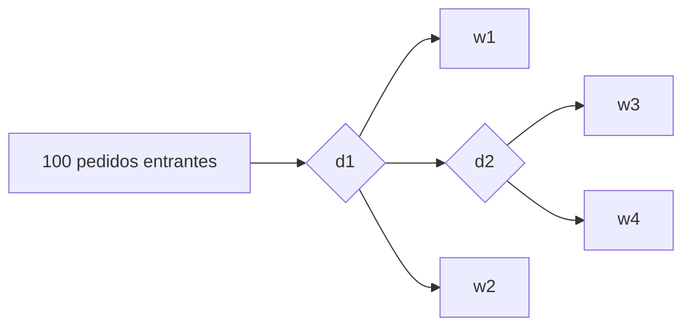
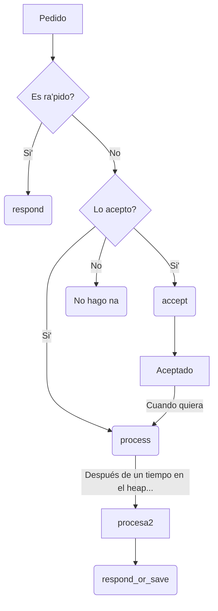

<h1> Game of Servers </h1>

<!-- @audit cambiar a 3ra persona ("se logro'", en lugar de "logramos") -->

- [Propuesta](#propuesta)
- [1ra Entrega](#1ra-entrega)
  - [Ejecutando `gos`](#ejecutando-gos)
  - [Modelo de un Líder y muchos Seguidores](#modelo-de-un-líder-y-muchos-seguidores)
    - [Variables](#variables)
    - [Eventos](#eventos)
- [2da Entrega](#2da-entrega)
  - [Sobre la Simulaci&oacute;n](#sobre-la-simulación)
    - [Ambiente](#ambiente)
    - [Agentes](#agentes)
    - [Status](#status)
    - [Eventos de la L&iacute;nea Temporal](#eventos-de-la-línea-temporal)
  - [Sobre el Lenguaje](#sobre-el-lenguaje)
    - [Caracter&iacute;sticas](#características)
    - [Gram&aacute;tica de GoS](#gramática-de-gos)
    - [Tipos](#tipos)
    - [Otras Reglas Sem&aacute;nticas](#otras-reglas-semánticas)
    - [Gram&aacute;tica de REGEX](#gramática-de-regex)
    - [DSL para las Gram&aacute;ticas](#dsl-para-las-gramáticas)
    - [*Syntax Highlight* en el Code](#syntax-highlight-en-el-code)
  - [Ejecutando `gos`](#ejecutando-gos-1)
- [3da Entrega](#3da-entrega)
  - [Simulación](#simulación)
    - [**Eventos**](#eventos-1)
    - [**Percepciones**](#percepciones)
    - [**Eventos Adicionales**](#eventos-adicionales)
    - [**Creador de Eventos**](#creador-de-eventos)
    - [**Ambiente**](#ambiente-1)
    - [**Microservicios**](#microservicios)
    - [**Modelado de Servidores**](#modelado-de-servidores)
    - [**Capas de Comportamiento**](#capas-de-comportamiento)
    - [**Comportamiento**](#comportamiento)
    - [**Comportamientos BuildIn**](#comportamientos-buildin)
    - [**Directorios**](#directorios)
  - [Flujo de un Pedido](#flujo-de-un-pedido)
- [IA](#ia)

## Propuesta

Somos

* Claudia Puentes Hernández ([@ClauP99](https://github.com/ClauP99)) :honeybee:,
* Omar Alejandro Hernández Ramírez ([@OmarHernandez99](https://github.com/OmarHernandez99)) :tiger:,
* Andy Ledesma García ([@MakeMake23](https://github.com/MakeMake23)) :wolf: y
* Mauricio Mahmud Sánchez ([@maux96](https://github.com/maux96)) :fox_face:

y proponemos que el proyecto conjunto de Simulación, Compilación e IA sea sobre servidores y se llame ***Game of Servers***.

La idea va de simular un entorno con una cantidad determinada de servidores y un número potencialmente infinito de clientes. Los clientes emitirán pedidos a los servidores y estos responderán en consecuencia :grin: o no :pensive:, como sucede en la realidad.

El usuario de nuestro proyecto podrá programar cada uno de los servidores para que responda a los pedidos según crea conveniente. Esto se realizará en un lenguaje creado por nosotros para este dominio específico :sunglasses:.

Un servidor también puede emitir pedidos a otro servidor :scream:, convirtiéndose el primero en un cliente del segundo. En este sentido, se pudieran aplicar algoritmos de IA :astonished: para enrutar el pedido de forma óptima entre servidores.

En un sistema como este se pueden simular:
* ataques DoS y DDoS
* pérdidas de usuarios y capital en servicios online por demora en las respuestas
* distintas estrategias de ruteo y de distribución de carga
* el accionar de cada uno de servers, como agentes autónomos
* la viabilidad del sistema en conjunto en cuanto a  la tolerancia a fallas, alta disponibilidad.

Incluyendo IA allá donde puede ser más útil :grin:.

## 1ra Entrega
En la primera entrega del proyecto simulamos el procesamiento de pedidos en un sistema compuesto por un servidor (repartidor de carga) que selecciona cu&aacute;l de los servidores restantes (*doers*) se encargar&aacute; de procesar el pedido entrante. En la secci&oacute;n [Modelo de un Líder y muchos Seguidores](#modelo-de-un-líder-y-muchos-seguidores) se explica en detalle c&oacute;mo modelamos este sistema.

Esta simulaci&oacute;n es ejecutada m&uacute;ltiples veces por un algoritmo gen&eacute;tico, con el objetivo de determinar el número de *doers* necesarios para minimizar el tiempo de respuesta a los pedidos.

El algoritmo gen&eacute;tico, a su vez, es ejecutado por una aplicaci&oacute;n de consola llamada `gos` que recibe sus par&aacute;metros del archivo `appsettings.json`. En la secci&oacute;n [Ejecutando gos](#ejecutando-gos) se explica c&oacute;mo se ejecuta el programa y el significado de cada par&aacute;metro.

### Ejecutando `gos`
Para ejecutar nuestro programa, descargue el *release* para su sistema operativo y abra el archivo `gos` (Linux) o `gos.exe` (Windows) desde una terminal.

Los par&aacute;metros deben ser configurados en el archivo `appsettings.json`. Estos son
- `Followers`: cantidad de *doers*.
- `Lambda`: parámetro lambda de la distribución exponencial para determinar tiempos de ocurrencia de los eventos.
- `CloseTime`: tiempo de cierre del sistema ($T$). Cuando se arribe a este tiempo, no se recibirán más pedidos.
- `MonthlyMaintenanceCost`: costo mensual máximo de mantenimiento del sistema.
- `RunTimeMilliseconds`: tiempo en milisegundos de corrida de la metaheurística.
- `Poblation`: número de individuos del algoritmo genético.


### Modelo de un Líder y muchos Seguidores
El sistema de la simulaci&oacute;n fue modelado mediante dos capas conectadas en serie: la del repartidor de carga (l&iacute;der) y la de los *doers* (seguidores). Estos &uacute;ltimos procesan los pedidos en paralelo.

A continuaci&oacute;n se definen las variables y los eventos de la simulaci&oacute;n.
#### Variables
- Variables de tiempo
  - $ t $ - tiempo general.
  - $ t_{A_1} $ - siguiente tiempo de arribo al líder.
  - $ t_{A_2} $ - siguiente tiempo de arribo a los seguidores.
  - $ t_{D_i} $ - siguiente tiempo de salida del i-ésimo seguidor.
- Variables contadoras
  - $ N_A $ - cantidad de arribos 
  - $ N_D $ - cantidad de partidas 
  - $ A_1 $ - Diccionario de tiempos de arribo al líder
  - $ A_{d_x} $ - Lista de diccionarios donde $ A_{d_i}[j]= t_j $, siendo  $ A_{d_i} $ el diccionario correspondiente al i-ésimo seguidor y $ t_j $ el tiempo de partida asociado al 'cliente' j-ésimo. 
- Variables de estado
  - $ n_1 $ - número de clientes en el líder.
  - $ n $ - número de clientes en el sistema.
  - $ F_s $ - servidores libres.
  - $ q $ - cantidad de 'clientes' esperando en la cola de los seguidores.

#### Eventos
- **Arribo al líder**  $( t_{A_1} == min( t_{A_1},t_{A_2}, t_{D_1},t_{D_2},... ) \wedge t_{A_1} < T ) $ :
  
  - $ t = t_{A_1} $
  - $ N_A = N_A + 1 $
  - $ n_1 = n_1 + 1 $
  - $ n = n + 1 $ 
  - $ generar~~t_{A_{L}} \wedge~~t_{A_1} = t + t_{A_{L}} $ 
  - $ if~(n_1 == 1)~~~then~~~~generar~~t_{A_S}~\wedge ~t_{A_2}=t + t_{A_S}$   
  - $ A_1[N_A] = t$
- **Arribo a los seguidores**  $( t_{A_2} == min( t_{A_1},t_{A_2}, t_{D_1},t_{D_2},... ) \wedge t_{A_2} < T )$ :
  - $ t = t_{A_2} $
  - $ n_1=n_1-1 $
  - $ if~(n_1 \ne 0)~~~then~~~~(generar~t_{A_S}~\wedge ~t_{A_2}=t + t_{A_S})$
  - $else~~~~t_{A_2} = \infin $
  - $ if~(|F_s| == 0)~~~then~~~~( q = q+1)$
  - $else:$
    - $ serv = F_s.Dequeue() $ 
    - $ client = N_A - n_1 $
    - $ generar~t_{D_S}~~\wedge~~t_{D_{serv}} =t + t_{D_S}$
    - se inserta $client$ en $serv$ 

- **Partida** $(min(t_{D_1},t_{D_2},...)==min( t_{A_1},t_{A_2}, t_{D_1},t_{D_2},... )) \wedge (min(t_{D_1},t_{D_2},...) \le T$:
  - $t_{Dmin}=min(t_{D_1},t_{D_2},...)$
  - $serv = ObtenerServidorPartida()$
  - $client = OptenerClienteQueParte()$ 
  - $ t = t_{Dmin}$
  - $ N_D = N_D +1$
  - $ n=n-1 $
  - $if~(q \ne 0)~~~then$ :
    - $q=q-1$ 
    - $client = N_A-q$
    - $generar~t_{D_{S}} ~~\wedge~~ t_{D_{serv,client}} = t + t_{D_{S}}  $
  - $else ~~~~F_s.Add(serv)$
  - $A_{d_{serv}}[client]= t_{Dmin} $
- **Arribo fuera de tiempo para el líder** $ (t_{A_1}\ne \infin \wedge t_{A_1} ==  min( t_{A_1},t_{A_2}, t_{D_1},t_{D_2},... ) \wedge  t_{A_1} >T) $:
  - $ t_{A_1} = \infin $
- **Arribo fuera de tiempo para los seguidores**  $ (t_{A_2}\ne \infin \wedge t_{A_2} ==  min( t_{A_1},t_{A_2}, t_{D_1},t_{D_2},... ) \wedge  t_{A_1} >T) $ :
  - $ t_{A_2} = \infin $
- **Cierre** $(min(t_{D_1},t_{D_2},...)==min( t_{A_1},t_{A_2}, t_{D_1},t_{D_2},... ))~~\wedge~~((min(t_{D_1},t_{D_2},...) > T)~~\wedge$

  $((min(t_{D_1},t_{D_2},...) \ne \infin)~~\wedge~~n>0$ :
  
  El evento de cierre es análogo al evento de partida.

## 2da Entrega
### Sobre la Simulaci&oacute;n
Se dej&oacute; de utilizar el modelo de eventos discretos y se emplea ahora un modelo de agentes.


#### Ambiente

El ambiente tiene variables configurables (por ahora constantes) del tiempo de llegada de Request y Response, una lista de todos los agentes en la escena, el tiempo actual de la simulación, los responses (una vez haya acabado la simulación) a los request del cliente que se hacen en un inicio y una estructura de datos Heap (de m&iacute;nimos) encargado de llevar acabo el funcionamiento de la l&iacute;nea de tiempo correctamente haciendo que transcurra este.

#### Agentes
Los agentes son los servidores y estos se dividen en 3 tipos:
- *workers* simples
- *workers* interactivos
- distribuidores de carga

Se model&oacute; un comportamiento de agente con estados, en el cual también incluimos el concepto de percepciones, este concepto lo utilizamos para representar el comportamiento de los request y response que se realizan durante la simulación.

Para comenzar se realizó una clase **Agent**  que es de la que van a heredar todos los servidores, entre estos se encuentra **Worker**, **InteractiveWorker**, **Distributor**. La clase **Agent** posee las principales propiedades de estos servidores, el ID de cada uno, un environment, un status y unas listas de funciones que son las que van a modelar de alguna manera el comportamiento de la funci&oacute;n **next** que se le pasa un status, un perception y devuelve un nuevo status.
Esta clase posee los funcionamientos de **HandleRequest**, **HandleResponse**, **HandleStatus**  que son los encargados de llevar a cabo el funcionamiento del servidor cuando llega un request, un response o el servidor necesita cambiar su estado interno basado en algo como el tiempo, esto se logra recorriendo cada una de las listas de funciones respectivas donde cada una hace un pequeño cambio en el estado del agente o del ambiente. En el caso del **HandleRequest**, antes de realizar lo anterior se verifica si el server está disponible para poder procesar el request.

La clase **Distributor** posee una lista de workers y un protocolo representado como una función de selección,  la cual es encargada de seleccionar el worker o server al que le vamos a enviar el request. Esta clase tiene funcionalidades como  añadir los workers, enviar un request , que sería  añadir el request a la lista de procesamiento de request en el estado, con el protocolo de selección escogemos el server al cual le vamos a enviar el request y subscribimos el evento al estado. Otra de las funcionalidades es chequear el response, si ya el response  está disponible pues se envía el request original si no, se selecciona otro worker y se envía el request.


La clase **InteractiveWorker** tiene un diccionario que posee las posibles necesidades del request y a cada una de estas se le asocia una lista de agentes que pueden dar response a este tipo de request, tiene otro diccionario que contiene todos los request que han llegado hasta el momento y a cada uno de estos se le asocia una lista de todos los request que fueron necesarios realizar para satisfacer sus necesidades y por último se tiene otro diccionario que contiene el id del request original contra el response que se irá conformando poco a poco. Aquí tenemos dos funcionalidades la primera es que si llegó un request revisamos si se encuentra en el diccionario de necesidades, si es asi enviamos un request a cada uno de los agentes que se encuentra en la lista de agentes asociada a la necesidad del request y la otra funcionalidad es a la hora en que llega un response, revisamos de cual request es y se verifica si  ya tenemos todos los responses necesarios para realizar el response del request original, si es así realizamos el proceso y si no continuamos hasta obtenerlo completo.

La clase **Worker** posee varias funcionalidades como **GettingRequest** que revisa si el servidor puede atender el request, si no puede envía un response de servidor no disponible y si no subscribe el evento. Otra de las funcionalidades es el procesamiento el request que si el servidor esta disponible añade el request a la lista de procesamiento de request y en dependencia de la cantidad de request que tenga el servidor a procesar cambia el estado a no disponible. El método **SendResponse** conforma el response de acuerdo al request original y lo envía y **SetAvailableAfterSendResponse** luego de enviar el response de un request se elimina este de la lista de request en procesamiento

#### Status

La clase **Status**, representa el estado interno de un Servidor por ahora, tiene como objetivo guardar valores necesarios en la ejecución de la simulación y también guardar estad&iacute;sticas. Este es modificado en las funciones de manejo de Request, Response u Observer. Tiene referencias a su agente correspondiente, y permite la suscripción de eventos a la l&iacute;nea temporal.


#### Eventos de la L&iacute;nea Temporal

Estas 3 clases a continuación, representan cada vez que ocurre algo en la simulación, **Request** representa la llegada de un request, **Response** la llegada de un response y **Observer** el conocimiento de un cambio en el estado interno de un agente. Estos se agregan al Heap del ambiente a medida que van apareciendo y cuando es su turno de salir del ambiente, se "ejecutan" en su agente correspondiente variando el funcionamiento del mismo de acuerdo a sus valores internos. 

La clase **Request** posee características como su ID que es único para cada request, la URL, el sender (quien lo envió) y el tiempo en que fue enviado. Son procesados por los agentes en el m&eacute;todo que llama a HandleRequest para cambiar de estado y otro método para conformar el response y suscribirlo al ambiente. 

La clase **Response** posee  propiedades similares a la clase **Request** como su ID, el sender, el que lo recibe, el tiempo, el cuerpo de la respuesta y dos booleanos para conocer si el response est&aacute; disponible o no. Son procesados por un agente al igual que en **Request**  en vez de ser HandleRequest es HandleResponse. 

La clase **Observer** tiene el agente el cual va (no necesariamente) a cambiar el estado, un objeto genérico (por ahora) el cual nos sirve para saber qu&eacute; tipo de cambio en el estado interno del agente se va llevar a cabo y como los anteriores tiene una referencia al ambiente correspondiente. Es procesado por su agente correspondiente al salir del Heap del ambiente en el método HandleStatus.

### Sobre el Lenguaje
El DSL se llama GoS y es un lenguaje de tipado din&aacute;mico desarrollado en C#. 

Se implement&oacute; un *parser* LR(1).

#### Caracter&iacute;sticas
Se puede declarar variables:


Emplear expresiones matem&aacute;ticas:


Se puede declarar funciones:


*Statements* en varias l&iacute;neas:


Crear servidores de tipo *worker* simple y distribuidores de carga:


Conectarlos:


Al primer distribuidor de carga declarado se le har&aacute;n 100 pedidos, resultando el grafo de flujo de la siguiente manera:


#### Gram&aacute;tica de GoS
```
<program> := <stat-list>

<stat-list> := <stat> ";"
             | <stat> ";" <stat-list>
             | <block-stat>
             | <block-stat> <stat-list>
             
<block-stat> := <if>
              | <def-func>
              | <inf-loop>
              | <foreach>
              | <behav>
              | <init>

<behav> := "behav" ID "{" <stat-list> "}"

<init> := "init" "{" <stat-list> "}"

<foreach> := "for" <id-list> "in" <expr> "{" <stat-list> "}"

<inf-loop> := "forever" "{" <stat-list> "}"

<stat> := <let-var>
        | <print-stat>
        | <return>
        | <func-call>
        | ID <right-conn>
        | <atom> "=" <expr>
        | "break"
        | <method-call>
        | "respond_or_save" <expr>
        | "process" <expr>
        | "respond" <expr>
        | "accept" <expr>
        | <ping>
        | "alarm_me" "in" <expr>
        | <ask>
        | <order>

<ask> := "ask" <atom> <after-rsrc-req>

<order> := "order" <atom> <after-rsrc-req>

<after-rsrc-req> := "in" <math> "for" <atom>
                  | "for" <atom>

<ping> := "ping" <atom> "in" <math>
        | "ping" <atom>

<let-var> := "let" ID "=" <expr>

<def-func> := "fun" ID "(" <id-list> ")" "{" <stat-list> "}"
            | "fun" ID "(" ")" "{" <stat-list> "}"

<print-stat> := "print" <expr>

<id-list> := ID
           | ID "," <id-list>

<disj> := <disj> "or" <conjtion>
        | <conjtion>

<conjtion> := <conjtion> "and" <cond>
            | <cond>

<cond> := <math> "<" <math>
        | <math> ">" <math>
        | <math> "==" <math>
        | <math>

<expr> := <disj>
        | <ping>
        | <ask>
        | <order>

<list-idx> := <factor> "[" <math> "]"

<gos-list> := "[" <expr-list> "]"
            | "[" "]"

<right-conn> := "->" <id-list>

<math> := <math> "+" <term>
        | <math> "-" <term>
        | <term>

<term> := <term> "*" <factor>
        | <term> "/" <factor>
        | <term> "%" <factor>
        | <factor>

<factor> := <atom>
          | "(" <expr> ")"

<atom> := NUMBER
        | BOOL
        | ID
        | <func-call>
        | <list-idx>
        | "new" CLASS
        | <gos-list>
        | <method-call>
        | <prop-get>
        | <is-type>

<is-type> := <atom> "is" <after-is>

<after-is> := <is-type-end>
            | "not" <is-type-end>

<is-type-end> := CLASS
               | CLASS ID

<prop-get> := <factor> "." ID

<method-call> := <factor> "." <func-call>

<func-call> := ID "(" <expr-list> ")"
             | ID "(" ")"

<expr-list> := <expr>
             | <expr> "," <expr-list>

<if-atom> := "if" <expr> "{" <stat-list> "}"

<else> := "else" "{" <stat-list> "}"
             
<if> := <if-atom>
      | <if-atom> <after-if>

<after-if> := <else-if>
            | <else>
            | <else-if> <else>

<else-if> := <else-if-atom>
           | <else-if-atom> <else-if>

<else-if-atom> := "else_if" <expr> "{" <stat-list> "}"

<return> := "return" <expr>
          | "return"
```
**El `;` lo pone el *lexer***, no es necesario que el usuario lo haga. Este puede emplear `\` para definir *statements* de m&aacute;s de una l&iacute;nea.


#### Tipos
El lenguaje tiene 4 tipos:
- `Number`: para todo tipo de n&uacute;meros
- `Bool`: para valores de verdad (*true* o *false*)
- `String`: para las cadenas de caracteres.
- `Server`: para los servidores
- `List`: para las listas.
- `Null`: para la no existencia de algo, por ejemplo, el tipo de retorno de las funciones que no devuelven nada.
- `ServerStatus`: para el estado de un servidor.
- Para la percepción que tiene el servidor sobre el ambiente, hay 3 tipos:
    - `Request`: pedido.
    - `Response`: respuesta.
    - `Alarm`: notificaci&oacute;n
- `Environment`: para el ambiente de la simulaci&oacute;n.
- `Resource`: para los recursos.
- `Layer`: para las capas de comportamientos de cada servidor.
- `Behavior`: para los comportamientos.

Los operadores `+`, `-`, `*`, `/`, `%` solo est&aacute;n permitidos para el tipo `Number`. 

En el caso del operador de conexi&oacute;n de servidores (`->`), solo est&aacute; permitido para el tipo `Server`, y el operando de la izquierda debe ser un distribuidor de carga (lo que se espera es que pueda ser de cualquier tipo de servidor; ser&aacute; rectificado en una entrega posterior).

Una variable no puede cambiar su tipo: una vez se ha inicializado mediante `let`, los pr&oacute;ximos valores a asignar deben
ser del mismo tipo que el valor inicial. <!--@todo poner co'digo d ejemplo-->

El indexado sobre las listas es en base 1.

#### Otras Reglas Sem&aacute;nticas
- Una variable solo puede ser definida una vez en un mismo ámbito.
- Los nombres de variables y funciones s&iacute; comparten el mismo
ámbito (no pueden existir una variable y una función llamadas
igual).
- No se pueden redefinir las funciones predefinidas.
- Una función puede tener distintas definiciones siempre que
tengan distinta cantidad de argumentos.
- Toda variable y función tiene que haber sido definida antes de
ser usada en una expresión (salvo las funciones pre-definidas).
- Todos los argumentos definidos en una misma función tienen
que ser diferentes entre sí, aunque pueden ser iguales a
variables definidas globalmente o a argumentos definidos en
otras funciones.
- En el cuerpo de una función, los nombres de los argumentos
ocultan los nombres de variables iguales.
- En el cuerpo de un *statement* de bloque o una función, los nombres de las variables definidas ocultan los 
nombres de variables en &aacute;mbitos superiores.
- El bloque `init`, de existir, debe ser el primer *statement* de un bloque `behav`.
- Todos los *statements* de un bloque `init` son de la forma `ID "=" <expr>`.
- El *statement* `return` no puede tener expresi&oacute;n asociada cuando se encuentra dentro
de un bloque de comportamiento.


#### Gram&aacute;tica de REGEX 
El lenguaje de REGEX utilizado es el definido en la correspondiente conferencia de la asignatura.

Para el procesamiento de expresiones regulares se emple&oacute; la siguiente gram&aacute;tica:
```
<regex> := <union>

<union> := <union> "|" <concat>
         | <concat>

<concat> := <concat> <basic>
          | <basic>

<basic> := <atom> "*" 
         | <atom> "+" 
         | <atom> "?" 
         | <atom>

<atom> := <group> 
        | CHAR 
        | <set>

<group> := "(" <regex> ")"

<set> := "[" <item-list> "]"

<item-list> := <item> 
             | <item> <item-list>

<item> := <range>
        | CHAR

<range> := CHAR "-" CHAR
```
`CHAR` es un tipo de *token* definido especialmente para esta gram&aacute;tica. Representa a un caracter del lenguaje que no es *meta*. Por ejemplo, dada la REGEX `a*\+`, el *lexer* de REGEX devuelve los siguientes *tokens*

| Tipo | Lexema |
|------|--------|
| CHAR | a |
| * | * |
| CHAR | + |

N&oacute;tese que como el `+` est&aacute; precedido por un `\`, entonces el *token* producido es de tipo `CHAR`, en lugar de tipo `+`.

#### DSL para las Gram&aacute;ticas
El equipo se enfrent&oacute; a la tarea de expresar estas gram&aacute;ticas en C# mediante el empleo de un DSL embebido, desarrollado por el propio equipo :muscle::sunglasses:. Se cree que fue una buena oportunidad para aplicar las ense&ntilde;anzas de las asignaturas Compilaci&oacute;n y LP. Para lograrlo, se utiliz&oacute; principalmente la sobrescritura de operadores.

La gram&aacute;tica de REGEX queda expresada entonces de esta manera:
```c#
Regex > Union,

Union > (Union | Concat),
Union > Concat,

Concat > (Concat, Basic),
Concat > Basic,

Basic > (Atom, times),
Basic > (Atom, plus),
Basic > (Atom, quest),
Basic > Atom,

Atom > Group,
Atom > @char,
Atom > Set,

Group > (lpar, Regex, rpar),

Set > (lbrak, ItemList, rbrak),

ItemList > Item,
ItemList > (Item, ItemList),

Item > Range,
Item > @char,

Range > @char - @char
```

#### *Syntax Highlight* en el Code
Es posible lograr *syntax highlight* de GoS en Visual Studio Code mediante la instalaci&oacute;n de la [extensi&oacute;n GoS](https://marketplace.visualstudio.com/items?itemName=TheGoSTeam.gos), desarrollada por el equipo.

### Ejecutando `gos`
Ahora el ejecutable del proyecto interpreta un archivo con c&oacute;digo en GoS y ejecuta la simulaci&oacute;n que se configura. La salida del programa es una serie de l&iacute;neas con el tiempo y cuerpo de cada respuesta a los pedidos. Si el pedido no pudo ser procesado, el cuerpo es "Servidor no disponible", mientras que si fue procesado por el servidor $w_1$, entonces el cuerpo es "Cosas de servidor simple w1".

En la entrega se encuentra un archivo `distrb.gos` en la carpeta `Sources/`. Este se puede ejecutar de la siguiente manera:
```console
$ gos Sources/distrb.gos
```

## 3da Entrega

### Simulación
  
La simulación presentada sigue el curso de la de la 2da entrega, mucho más extendida. En la actual versión se amplían mucho los escenarios que se pueden reproducir, así como las facilidades del lenguaje, Gos, lo que nos permite simular aspectos más complejos de una manera más fácil; sin más, pasaremos a presentarlas:

Como decimos en anteriores entregas, lo que se simula es un ambiente de servidores distribuidos, donde el evento principal del medio son los pedidos de recursos de los clientes, y la tarea de los servidores es proveerselos. 

En el modelo usado están embebidos el **modelo de eventos discretos** y el **modelo de agentes inteligentes**, por lo que lo catalogamos como **mixto**.

Esto se modeló tratando de darle una responsabilidad única a cada clase para respetar principalmente el *Single Responsability* de SOLID, de la siguiente forma :

#### **Eventos**
Un evento `Event`, en el sistema presentado es un ente que representa un cambio en el Ambiente, puede ser desde un `Request` de un cliente a "www.cubadebate.cu"; hasta eventos meteorológicos que afecten la conectividad con algunos servidores o la interrumpa. Los eventos se ejecutan en algún momento en el tiempo.

#### **Percepciones**
Ahora bien, no todos los eventos le incumben directamente a un servidor, como un terremoto, o un evento de creacion de servidores. Los que sí lo hacen son los que llamamos percepciones del medio ambiente, **Perception**, y son principalmente los mensajes entre servidores(**Request**, y **Response**).

- un *Request*, que es una solicitud de recursos o acción a algún servidor.
- un *Response*, que es una respuesta a un *Request*.
- *Alarm*, la llegada de lo que denominamos en el DSL como *Alarm* que no es mas que la posibilidad que le dimos al sistema que (a nivel de implementación) le diga a un Servidor que debe cambiar su estado interno por alguna razón que el mismo servidor conoce. Esto es muy útil ya que nos permite no tener en cada instancia de tiempo que revisar si todos los servidores tienen algún cambio de estado interno.

#### **Eventos Adicionales**
Son eventos que no son generados por los servidores, suelen simular fallas en los sistemas o algo que los afecte directamente, imposibilitando su uso o modificando algún aspecto de su funcionamiento. 

#### **Creador de Eventos**
El creador de eventos `EventCreator` es la clase encargada de proveer de eventos aleatorios a un Ambiente. Se instancia en una lista de eventos, y otra de probabilidades asociadas a estos, y, básicamente, devuelve un iterador infinito de eventos, donde la función de probabilidad distribuye en función de la 2da lista. Por ej, dado:
```
events = [Request, CriticalFailure]
probs = [0.9, 0.1]
eventCrtor ( events, probs )
```
Cada elemento que devuelva el iterador de `eventCrtor` sera un `Request`, o un `CriticalFailure` aleatorio, con una probabilidad de 0.9 y 0.1 respectivamente. El tiempo en que ocurre el evento se genera con una v.a. que distribuye Poisson.

#### **Ambiente**
El ambiente (`Env`) es el mundo donde corre la simulación, su responsabilidad principal es la de correr los eventos que fueron creados en esta instancia de `Env` en el orden en que ocurren. Posee caracteristicas generales de la simulación y da acceso a algunas estadisticas finales como la cantidad de respuestas satisfechas a pedidos de los clientes.
  
#### **Microservicios**
Cada servidor pertenece a un microservicio, el cual tiene como objetivo usualmente responder a Requests asociados a un tipo de servicio. Cada Microservicio tiene un lider que es el encargado de recibir Request externos al microservicio, este suele tener comportamientos iguales o parecidos a los de un *Jefe*.

#### **Modelado de Servidores**
los Agentes (**Server**) se caracterizan principalmente por:

- Capacidad de Procesamiento
- Capas de Comportamiento Personalizadas

La capacidad de procesamiento se mide en *Micros*, y determina la cantidad de pedidos que un server puede atender a la vez.
Las capas atienden al modelo de capas verticales:


De esta forma, cuando llega una percepción del medio, se pasa por todas las capas, en orden, y la salida de una pasa a la siguiente, ya que tienen control sobre el estado interno del agente. Al finalizar, se obtiene un nuevo estado interno del agente, y un conjunto de acciones que decidieron hacer las capas en su conjunto, que se subscriben al **Env** como mensajes.

#### **Capas de Comportamiento**
Una capa de comportamiento, **Layer**, es una clase que engloba comportamientos. Está definida por una lista de **Behaviors**, y una *función de selección* que es la encargada de decidir que comportamiento aplicar en cada ocasion.
Una aplicación de los *layers* puede ser para englobar comportamientos incoherentes entre si, entre los que se quiera decidir el mejor a aplicar en cada momento, pero nunca varios a la vez. Por defecto *build-in* una función selectora, de la que hablaremos en la parte de IA más adelante.
  
#### **Comportamiento**
Un comportamiento, **Behavior**, es una secuencia de acciones a seguir, dado un estado interno del servidor **State**, y un estímulo del medio ambiente dado **Perception**.
Los comportamientos además de recibir estos parámetros, tienen variables persistentes entre un llamado y otro, lo que permite que puedan tener memoria, y se ejecuten comportamientos más complejos.

Este modelo da la posibilidad de crear capas personalizadas por el usuario a través del DSL permitiendo lograr comportamientos no previamente definidos.

A pesar de esta posibilidad brindamos implementaciones de comportamientos de servidores que creemos fundamentales en nuestra simulación. Especialmente porque nos dimos la tarea de implementar una comunicación entre servidores *buildin*, y a la vez, darle al DSL la suficiente fuerza como para poder construir los mismos comportamientos, desde 0, con mucha menos dificultad de la requerida en C# por supuesto.

Los comportamientos siguientes atienden principalmente a una planificación entre los servidores de tipo *Red de Contrato*:
#### **Comportamientos BuildIn**
  - *Jefe* : 

    Es el comportamiento que se le da al servidor encargado de pedir recursos dentro de un microservicio. Cada vez que llega a él un *Request* pide los recursos solicitados por este a los integrantes de su microservicio a través de la interacción *Request-Response*, una vez satisfechos los recursos solicitados retorna un *Response* al servidor solicitante.

    Este comportamiento a la hora de solicitar un recurso a los integrantes de su microservicio (pedidos por otro servidor), lo pide basado en una función de credibilidad modificable, el servidor que más rápido responda a sus pedidos, lo puntua con credibilidad dentro del microservicio, priorizando que la proxima vez que se haga un pedido se tenga en cuenta quien se le debe de pedir recursos sobre los demás.

  - *Empleado*:
    
    Para este comportamiento, dado un *Request* que le llega preguntando si puede resolver algo, esta comprueba si lo quiere o puede resolver (dado el resultado de una función de aceptación), en caso positivo responde afirmativamente para notificar al enviante de que va a aceptar lo preguntado por el *Request*, para que el enviante sepa que ya puede mandar un *Request* imperativo, diciendole a otros comportamientos que este servidor posea (como comportamiento de Trabajador) lo que tienen que hacer o procesar. Su uso va estrechamente relacionado con la existencia de algún servidor con comportamiento de Jefe, creando una *red de contrato* al interactuar entre ellos.

  - *Trabajador*:

    Es el comportamientos que se le da a los servidores destinados al procesamiento, este toma los pedidos ya aceptados previamente y los "procesa" para "obtener" los recursos asociados a estos. Después de el tiempo necesario de procesamiento, este construye una respuestas a los pedidos las retorna en forma de Response.

  - *Lider Caído*:

    Este es un comportamiento de sustitución de lider, el cual consiste en estar comunicandose cada determinados intervalos de tiempo con el lider actual del microservicio. Si este en algún momento detecta que el lider actual no esta disponible, intenta conectarse varias veces más. Cuando este ya verifica que efectivamente el lider actual está "caído", informa a todo el microservicio mandando un mensaje que este va a sustituir al lider actual. El servidor que posee este comportamiento suele tener el comportamiento de *Jefe* u otro que actue como tal para saber desempeñar la función de lider en caso de sustituya al lider del microservicio.


#### **Directorios**

Los directorios son la manera en que se organiza la planificacion en la red de un microservicio. Contiene **Paginas Amarillas** con información sobre que servers pueden proveer un recurso y **Paginas Blancas** que ofrecen información de conocimiento común sobre un server tal como su capacidad de procesamiento en paralelo y su la creedibilidad (o confiabilidad) de acuerdo a su historia de *Requests* respondidas.


### Flujo de un Pedido


## IA

De IA usamos principalmente Metaheuristicas con algunas modificaciones. 

La planificacion como *Red de Contrato* se ayuda de una Metaheurística para decidir a que servers mandarles los pedidos. Más especificamente, es una adaptación de Colonias de Hormigas en un sistema distribuido, ya que más que simular el algoritmo, el conjunto de servidores **hace** el colonia de hormigas. Cuando un servidor realiza una tarea correctamente, se le aumenta su reputación, por el servidor que le pidio hacer la tarea, en función del tiempo en que la logró hacer. Y para decidir entre varios servidores, elige con mayor probabilidad a los servidores con mayor reputación. Además cada cierto tiempo se reduce la reputación a todos los servers de un microservicio. Observemos que, esto es precisamente Colonia de Hormigas, donde el alimento son los servidores de calidad, y las feromonas son la reputación.

Por otro lado, recordemos que los servers se componen de Layers, y estos pueden tener varios comportamientos, pero ... cual usar en cada momento? A esto también se le responde con una metaheurística. La función de selección usada hace una busqueda de a pasos por el mejor comportamiento. Primero, a modod de explotación usa los comportamientos de forma aleatoria, y cada un ciclo de tiempo, cambia de comportamiento, guardando la cantidad de reputacion que ganó usandolo. Luego de terminar de explorar, adopta un enfoque de explotación, donde elije el comportamiento con probabilidad, basandose en cuanta reputación le ha hecho ganar cada comportamiento en función del total de reputación que ha ganado. De cierta forma, si lo primero eran las hormigas optimizando la ruta hacia el alimento, estos son los alimentos buscando la manera de ser mas apetitosos.

Como forma de integrar la IA también se usó la propia simulación. El objetivo era, dado presupuesto, un conjunto de comportamientos, y uno de recursos que quiero proveer, cual es la mejor distribución de servidores con recursos, capas y comportamientos definidos de manera que entre en el presupuesto, y minimice el tiempo de respuesta por pedido, maximice el porciento de respuesta general, etc. Para esto se quiso usar un algorimo génetico que usara "Individuos", donde un *Individuo* es una instancia de la simulación entera, una configuración inicial.

Un individuo representa un proceso de simulación, con sus microservicios, los servidores de cada microservicio sus capas y comportamientos que se encuentran en cada una.  
Para simbolizar el "individuo" se creó una clase *IndividualSim* la cual posee una lista de *MicroServerSim*, esta lista representa de una manera más sencilla la cantidad de microservicios que van a estar en la simulación y asi en cada uno de elementos de esta lista hay otra de *ServerSim* que contiene todos los servidores que perteneceran al microservicio. En un *ServerSim* se encuentra una lista de *resources* y una lista de *Layers* donde en cada posición estan los *behavior* que posee ese *layer*. Todas estas representaciones son con enteros (int) para que el proceso de mezcla sea mas fácil.

Para poder lograr una biyección entre un individuo y una instancia de una simulación, se usan los enteros que representan los *behavior* y *resources*, se tiene una clase llamada *FactorySim* que contiene las listas de todos los *Bahaviors* y *Resources* que existen. Esta clase también posee un método *RunSimulation* que dado un individuo crea un ambiente y devulve la salida de la simulación, por donde se pasa luego una función a minimizar.

Hicimos la clase Genetic que es donde realizamos el proceso de selección de los individuos más prometedores. A partir de una población de individuos generados de manera aleatoria se seleccionan los mejores padres pasando cada uno por una función de validación. Luego de obtener los padres potenciales se comienza a crear nuevos individuos (hijos) mediante entrecruzamiento con sus dos padres. En el entrecruzamiento se toman tanto las características de un padre como del otro, teniendo en cuenta criterios de probabilidad, además pueden surgir mutaciones en el nuevo individuo dependiendo si la variable aleatoria generada es menor que la probabilidad de mutación.

