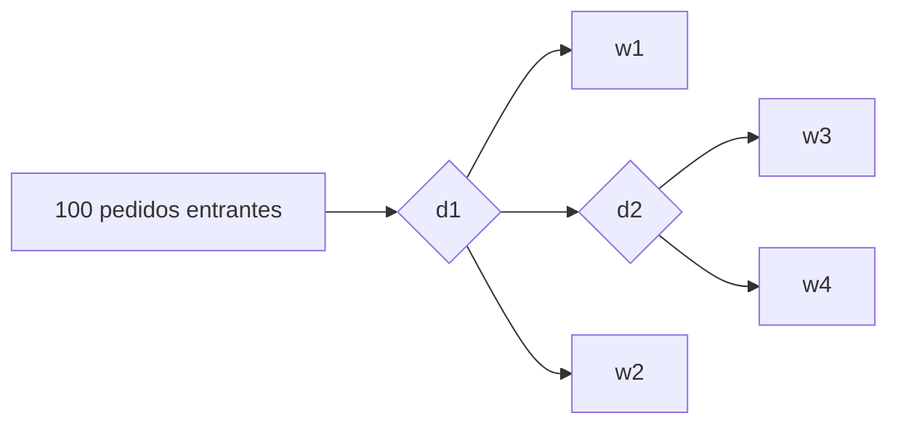
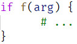

<h1> Game of Servers </h1>

<!-- @audit cambiar a 3ra persona ("se logro'", en lugar de "logramos") -->

- [Propuesta](#propuesta)
- [1ra Entrega](#1ra-entrega)
  - [Ejecutando `gos`](#ejecutando-gos)
  - [Modelo de un Líder y muchos Seguidores](#modelo-de-un-líder-y-muchos-seguidores)
    - [Variables](#variables)
    - [Eventos](#eventos)
- [2da Entrega](#2da-entrega)
  - [Sobre la Simulaci&oacute;n](#sobre-la-simulación)
  - [Sobre el Lenguaje](#sobre-el-lenguaje)
    - [Caracter&iacute;sticas](#características)
    - [Gram&aacute;tica de GoS](#gramática-de-gos)
    - [Tipos](#tipos)
    - [Reglas Sem&aacute;nticas](#reglas-semánticas)
    - [Gram&aacute;tica de REGEX](#gramática-de-regex)
    - [DSL para las Gram&aacute;ticas](#dsl-para-las-gramáticas)
  - [Ejecutando `gos`](#ejecutando-gos-1)

## Propuesta

Somos

* Claudia Puentes Hernández ([@ClauP99](https://github.com/ClauP99)) :bee:,
* Omar Alejandro Hernández Ramírez ([@OmarHernandez99](https://github.com/OmarHernandez99)) :tiger:,
* Andy Ledesma García ([@MakeMake23](https://github.com/MakeMake23)) :wolf: y
* Mauricio Mahmud Sánchez ([@maux96](https://github.com/maux96)) :fox_face:

y proponemos que el proyecto conjunto de Simulación, Compilación e IA sea sobre servidores y se llame ***Game of Servers***.

La idea va de simular un entorno con una cantidad determinada de servidores y un número potencialmente infinito de clientes. Los clientes emitirán pedidos a los servidores y estos responderán en consecuencia :grin: o no :pensive:, como sucede en la realidad.

El usuario de nuestro proyecto podrá programar cada uno de los servidores para que responda a los pedidos según crea conveniente. Esto se realizará en un lenguaje creado por nosotros para este dominio específico :sunglasses:.

Un servidor también puede emitir pedidos a otro servidor :scream:, convirtiéndose el primero en un cliente del segundo. En este sentido, se pudieran aplicar algoritmos de IA :astonished: para enrutar el pedido de forma óptima entre servidores.

En un sistema como este se pueden simular:
* ataques DoS y DDoS
* pérdidas de usuarios y capital en servicios online por demora en las respuestas
* distintas estrategias de ruteo y de distribución de carga
* el accionar de cada uno de servers, como agentes autónomos
* la viabilidad del sistema en conjunto en cuanto a  la tolerancia a fallas, alta disponibilidad.

Incluyendo IA allá donde puede ser más útil :grin:.

## 1ra Entrega
En la primera entrega del proyecto simulamos el procesamiento de pedidos en un sistema compuesto por un servidor (repartidor de carga) que selecciona cu&aacute;l de los servidores restantes (*doers*) se encargar&aacute; de procesar el pedido entrante. En la secci&oacute;n [Modelo de un Líder y muchos Seguidores](#modelo-de-un-líder-y-muchos-seguidores) se explica en detalle c&oacute;mo modelamos este sistema.

Esta simulaci&oacute;n es ejecutada m&uacute;ltiples veces por un algoritmo gen&eacute;tico, con el objetivo de determinar el número de *doers* necesarios para minimizar el tiempo de respuesta a los pedidos.

El algoritmo gen&eacute;tico, a su vez, es ejecutado por una aplicaci&oacute;n de consola llamada `gos` que recibe sus par&aacute;metros del archivo `appsettings.json`. En la secci&oacute;n [Ejecutando gos](#ejecutando-gos) se explica c&oacute;mo se ejecuta el programa y el significado de cada par&aacute;metro.

### Ejecutando `gos`
Para ejecutar nuestro programa, descargue el *release* para su sistema operativo y abra el archivo `gos` (Linux) o `gos.exe` (Windows) desde una terminal.

Los par&aacute;metros deben ser configurados en el archivo `appsettings.json`. Estos son
- `Followers`: cantidad de *doers*.
- `Lambda`: parámetro lambda de la distribución exponencial para determinar tiempos de ocurrencia de los eventos.
- `CloseTime`: tiempo de cierre del sistema ($T$). Cuando se arribe a este tiempo, no se recibirán más pedidos.
- `MonthlyMaintenanceCost`: costo mensual máximo de mantenimiento del sistema.
- `RunTimeMilliseconds`: tiempo en milisegundos de corrida de la metaheurística.
- `Poblation`: número de individuos del algoritmo genético.


### Modelo de un Líder y muchos Seguidores
El sistema de la simulaci&oacute;n fue modelado mediante dos capas conectadas en serie: la del repartidor de carga (l&iacute;der) y la de los *doers* (seguidores). Estos &uacute;ltimos procesan los pedidos en paralelo.

A continuaci&oacute;n se definen las variables y los eventos de la simulaci&oacute;n.
#### Variables
- Variables de tiempo
  - $ t $ - tiempo general.
  - $ t_{A_1} $ - siguiente tiempo de arribo al líder.
  - $ t_{A_2} $ - siguiente tiempo de arribo a los seguidores.
  - $ t_{D_i} $ - siguiente tiempo de salida del i-ésimo seguidor.
- Variables contadoras
  - $ N_A $ - cantidad de arribos 
  - $ N_D $ - cantidad de partidas 
  - $ A_1 $ - Diccionario de tiempos de arribo al líder
  - $ A_{d_x} $ - Lista de diccionarios donde $ A_{d_i}[j]= t_j $, siendo  $ A_{d_i} $ el diccionario correspondiente al i-ésimo seguidor y $ t_j $ el tiempo de partida asociado al 'cliente' j-ésimo. 
- Variables de estado
  - $ n_1 $ - número de clientes en el líder.
  - $ n $ - número de clientes en el sistema.
  - $ F_s $ - servidores libres.
  - $ q $ - cantidad de 'clientes' esperando en la cola de los seguidores.

#### Eventos
- **Arribo al líder**  $( t_{A_1} == min( t_{A_1},t_{A_2}, t_{D_1},t_{D_2},... ) \wedge t_{A_1} < T ) $ :
  
  - $ t = t_{A_1} $
  - $ N_A = N_A + 1 $
  - $ n_1 = n_1 + 1 $
  - $ n = n + 1 $ 
  - $ generar~~t_{A_{L}} \wedge~~t_{A_1} = t + t_{A_{L}} $ 
  - $ if~(n_1 == 1)~~~then~~~~generar~~t_{A_S}~\wedge ~t_{A_2}=t + t_{A_S}$   
  - $ A_1[N_A] = t$
- **Arribo a los seguidores**  $( t_{A_2} == min( t_{A_1},t_{A_2}, t_{D_1},t_{D_2},... ) \wedge t_{A_2} < T )$ :
  - $ t = t_{A_2} $
  - $ n_1=n_1-1 $
  - $ if~(n_1 \ne 0)~~~then~~~~(generar~t_{A_S}~\wedge ~t_{A_2}=t + t_{A_S})$
  - $else~~~~t_{A_2} = \infin $
  - $ if~(|F_s| == 0)~~~then~~~~( q = q+1)$
  - $else:$
    - $ serv = F_s.Dequeue() $ 
    - $ client = N_A - n_1 $
    - $ generar~t_{D_S}~~\wedge~~t_{D_{serv}} =t + t_{D_S}$
    - se inserta $client$ en $serv$ 

- **Partida** $(min(t_{D_1},t_{D_2},...)==min( t_{A_1},t_{A_2}, t_{D_1},t_{D_2},... )) \wedge (min(t_{D_1},t_{D_2},...) \le T$:
  - $t_{Dmin}=min(t_{D_1},t_{D_2},...)$
  - $serv = ObtenerServidorPartida()$
  - $client = OptenerClienteQueParte()$ 
  - $ t = t_{Dmin}$
  - $ N_D = N_D +1$
  - $ n=n-1 $
  - $if~(q \ne 0)~~~then$ :
    - $q=q-1$ 
    - $client = N_A-q$
    - $generar~t_{D_{S}} ~~\wedge~~ t_{D_{serv,client}} = t + t_{D_{S}}  $
  - $else ~~~~F_s.Add(serv)$
  - $A_{d_{serv}}[client]= t_{Dmin} $
- **Arribo fuera de tiempo para el líder** $ (t_{A_1}\ne \infin \wedge t_{A_1} ==  min( t_{A_1},t_{A_2}, t_{D_1},t_{D_2},... ) \wedge  t_{A_1} >T) $:
  - $ t_{A_1} = \infin $
- **Arribo fuera de tiempo para los seguidores**  $ (t_{A_2}\ne \infin \wedge t_{A_2} ==  min( t_{A_1},t_{A_2}, t_{D_1},t_{D_2},... ) \wedge  t_{A_1} >T) $ :
  - $ t_{A_2} = \infin $
- **Cierre** $(min(t_{D_1},t_{D_2},...)==min( t_{A_1},t_{A_2}, t_{D_1},t_{D_2},... ))~~\wedge~~((min(t_{D_1},t_{D_2},...) > T)~~\wedge$

  $((min(t_{D_1},t_{D_2},...) \ne \infin)~~\wedge~~n>0$ :
  
  El evento de cierre es análogo al evento de partida.

## 2da Entrega
### Sobre la Simulaci&oacute;n
Se dej&oacute; de utilizar el modelo de eventos discretos y se emplea ahora un modelo de agentes.

Los agentes son los servidores y estos se dividen en 3 tipos:
- *workers* simples
- *workers* interactivos
- distribuidores de carga

<!-- @todo meterc + adentro d esto, hablar d co'mo encapsulamos los comportamientos en funciones. Creo q los comportamientos c dividen en 3 -->
### Sobre el Lenguaje
El DSL se llama GoS y es un lenguaje de tipado din&aacute;mico desarrollado en C#. 

Se implement&oacute; un *parser* LR(1).

#### Caracter&iacute;sticas
Se puede declarar variables:


Emplear expresiones matem&aacute;ticas:


Se puede declarar funciones:


*Statements* en varias l&iacute;neas:


Crear servidores de tipo *worker* simple y distribuidores de carga:


Conectarlos:


Al primer distribuidor de carga declarado se le har&aacute;n 100 pedidos, resultando el grafo de flujo de la siguiente manera:


#### Gram&aacute;tica de GoS
```
<program> := <stat-list>

<stat-list> := <stat> ";"
             | <stat> ";" <stat-list>
	         | <block-stat>
             | <block-stat> <stat-list>
             
<block-stat> := <if>
              | <def-func>

<stat> := <let-var>
        | <print-stat>
        | <return>
        | <func-call>
        | ID <right-conn>

<let-var> := "let" ID "=" <expr>

<def-func> := "fun" ID "(" <id-list> ")" "{" <stat-list> "}"

<print-stat> := "print" <expr>

<id-list> := ID
           | ID "," <id-list>

<cond> := <math> "<" <math>
		| <math> ">" <math>
        | <math> "==" <math>

<expr> := <cond>
		| <math>
        | "simplew"
        | "distw"

<right-conn> := "->" <id-list>

<math> := <math> "+" <term>
        | <math> "-" <term>
        | <term>

<term> := <term> "*" <factor>
        | <term> "/" <factor>
        | <factor>

<factor> := <atom>
          | "(" <math> ")"

<atom> := NUMBER
        | ID
        | <func-call>

<func-call> := ID "(" <expr-list> ")"

<expr-list> := <expr>
             | <expr> "," <expr-list>
             
<if> := "if" <cond> "{" <stat-list> "}"

<return> := "return" <expr>
```
**El `;` lo pone el *lexer***, no es necesario que el usuario lo haga. Este puede emplear `\` para definir *statements* de m&aacute;s de una l&iacute;nea.

N&oacute;tese que bajo esta gram&aacute;tica no se soporta el llamado a funciones en la condigi&oacute;n del `if`:



Esto el equipo lo tiene en cuenta y ser&aacute; rectificado en entregas posteriores.

#### Tipos
El lenguaje tiene 3 tipos:
- `Number`: para todo tipo de n&uacute;meros
- `Bool`: para valores de verdad (*true* o *false*)
- `Server`: para los servidores

Los operadores `+`, `-`, `*`, `/` solo est&aacute;n permitidos para el tipo `Number`. 

En el caso del operador de conexi&oacute;n de servidores (`->`), solo est&aacute; permitido para el tipo `Server`, y el operando de la izquierda debe ser un distribuidor de carga (lo que se espera es que pueda ser de cualquier tipo de servidor; ser&aacute; rectificado en una entrega posterior).
#### Reglas Sem&aacute;nticas
- Una variable solo puede ser definida una vez en todo el
programa.
- Los nombres de variables y funciones no comparten el mismo
ámbito (pueden existir una variable y una función llamadas
igual).
- No se pueden redefinir las funciones predefinidas.
- Una función puede tener distintas definiciones siempre que
tengan distinta cantidad de argumentos.
- Toda variable y función tiene que haber sido definida antes de
ser usada en una expresión (salvo las funciones pre-definidas).
- Todos los argumentos definidos en una misma función tienen
que ser diferentes entre sí, aunque pueden ser iguales a
variables definidas globalmente o a argumentos definidos en
otras funciones.
- En el cuerpo de una función, los nombres de los argumentos
ocultan los nombres de variables iguales.
- En el cuerpo de un *statement* de bloque o una función, los nombres de las variables ocultan los nombres de variables en &aacute;mbitos superiores.

#### Gram&aacute;tica de REGEX 
El lenguaje de REGEX utilizado es el definido en la correspondiente conferencia de la asignatura.

Para el procesamiento de expresiones regulares se emple&oacute; la siguiente gram&aacute;tica:
```
<regex> := <union>

<union> := <union> "|" <concat>
         | <concat>

<concat> := <concat> <basic>
          | <basic>

<basic> := <atom> "*" 
         | <atom> "+" 
         | <atom> "?" 
         | <atom>

<atom> := <group> 
        | CHAR 
        | <set>

<group> := "(" <regex> ")"

<set> := "[" <item-list> "]"

<item-list> := <item> 
             | <item> <item-list>

<item> := <range>
        | CHAR

<range> := CHAR "-" CHAR
```
`CHAR` es un tipo de *token* definido especialmente para esta gram&aacute;tica. Representa a un caracter del lenguaje que no es *meta*. Por ejemplo, dada la REGEX `a*\+`, el *lexer* de REGEX devuelve los siguientes *tokens*

| Tipo | Lexema |
|------|--------|
| CHAR | a |
| * | * |
| CHAR | + |

N&oacute;tese que como el `+` est&aacute; precedido por un `\`, entonces el *token* producido es de tipo `CHAR`, en lugar de tipo `+`.

#### DSL para las Gram&aacute;ticas
El equipo se enfrent&oacute; a la tarea de expresar estas gram&aacute;ticas en C# mediante el empleo de un DSL embebido, desarrollado por el propio equipo :muscle::sunglasses:. Se cree que fue una buena oportunidad para aplicar las ense&ntilde;anzas de las asignaturas Compilaci&oacute;n y LP. Para lograrlo, se utiliz&oacute; principalmente la sobrescritura de operadores.

La gram&aacute;tica de REGEX queda expresada entonces de esta manera:
```c#
Regex > Union,

Union > (Union | Concat),
Union > Concat,

Concat > (Concat, Basic),
Concat > Basic,

Basic > (Atom, times),
Basic > (Atom, plus),
Basic > (Atom, quest),
Basic > Atom,

Atom > Group,
Atom > @char,
Atom > Set,

Group > (lpar, Regex, rpar),

Set > (lbrak, ItemList, rbrak),

ItemList > Item,
ItemList > (Item, ItemList),

Item > Range,
Item > @char,

Range > @char - @char
```

### Ejecutando `gos`
Ahora el ejecutable del proyecto interpreta un archivo con c&oacute;digo en GoS y ejecuta la simulaci&oacute;n que se configura. La salida del programa es una serie de l&iacute;neas con el tiempo y cuerpo de cada respuesta a los pedidos. Si el pedido no pudo ser procesado, el cuerpo es "Servidor no disponible", mientras que si fue procesado por el servidor $w_1$, entonces el cuerpo es "Cosas de servidor simple w1".

En la entrega se encuentra un archivo `distrb.gos` en la carpeta `Sources/`. Este se puede ejecutar de la siguiente manera:
```console
$ gos Sources/distrb.gos
```